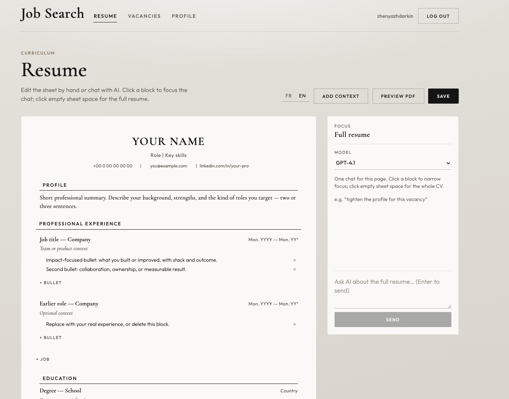

# Job Search

A personal tool that ties together the three things I needed for my own job search: an AI chat that edits a structured resume against my real career history and each vacancy's text, a LaTeX renderer that turns that resume straight into a polished PDF, and a tracker for every vacancy I'm targeting (not applied → applied → interview → offer/rejected/withdrawn). One place instead of a resume doc, a LaTeX template, and a spreadsheet.

## Demo



## Repository layout

| Path | Role |
|------|------|
| [`core-api/`](core-api/) | Spring Boot HTTP API (Postgres, OpenRouter, LaTeX → PDF) |
| [`frontend/`](frontend/) | React + Vite UI |
| [`tools/ats-screener/`](tools/ats-screener/) | ATS Screener (git submodule) — local scanner on `:5174` |
| [`docker-compose.yml`](docker-compose.yml) | Local Postgres |
| [`.env.example`](.env.example) | Environment template |

## Documentation

- **Backend:** [core-api/README.md](core-api/README.md) — stack, auth, config, schema, full HTTP API
- **Frontend:** React + Vite SPA in [`frontend/`](frontend/) — resume sheet editor, AI chat panel, vacancy list/detail, ATS match panel

## Quick start (one command)

Prerequisites: Docker, Java 25, Node **≥ 22.13** (for ATS; frontend works on 18+), `pnpm` 10+, optional `tectonic`.

```bash
cp .env.example .env
# set OPENROUTER_API_KEY in .env
# set APP_ADMIN_EMAIL (+ APP_BOOTSTRAP_PASSWORD) — registration is invite-only,
# this is the account the backend auto-creates as ADMIN on first boot
# ATS keys: cp tools/ats-screener/.env.example tools/ats-screener/.env
#   then add GEMINI_API_KEY / GROQ_API_KEY

git submodule update --init --recursive
npm run setup          # root + frontend + ats deps
npm run dev            # postgres + api + web + ats
```

Sign in with `APP_ADMIN_EMAIL` / `APP_BOOTSTRAP_PASSWORD`, then mint an invite code for any other account with `POST /api/invite-codes` (admin session required — no UI for this yet, see [core-api/README.md](core-api/README.md#authentication)) — registration always requires one.

| Service | URL |
|---------|-----|
| API | http://localhost:8080 |
| App UI | http://localhost:5173 |
| ATS Screener | http://127.0.0.1:5174/scanner |
| Postgres | localhost:5432 |

Useful variants:

```bash
npm run dev:core       # infra + api + frontend (no ATS)
npm run infra:down     # stop Postgres
```

Ctrl+C stops API, web, and ATS; containers keep running until `infra:down`.

### Manual (separate terminals)

```bash
docker compose up -d
cd core-api && ./mvnw spring-boot:run
cd frontend && npm run dev
cd tools/ats-screener && pnpm exec vite dev --host 127.0.0.1 --port 5174
```
